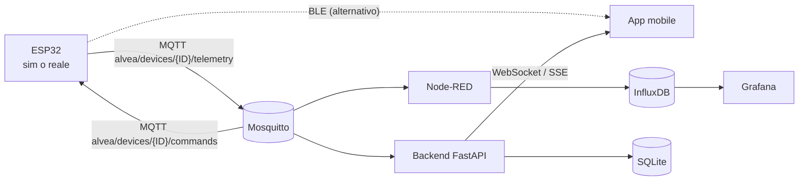

# Alvea

Dispositivo indossabile da caviglia **didattico** per il monitoraggio dell'**asma pediatrico** (SpO2, frequenza respiratoria, battito cardiaco, temperatura cutanea), 
con rilevamento dell'aderenza del sensore.
Progetto per *Academy Medical Wearable Devices*.

> ⚠️ **Dispositivo didattico, non medico.** Non usare per decisioni sanitarie
> reali. Vedi [`docs/SICUREZZA.md`](docs/SICUREZZA.md).


# Cosa fa

L'ESP32 acquisisce i parametri (sensori reali PPG **analogico**, ECG **AD8232**, termistore **NTC di precisione**) e li invia **a 1 Hz**. Il sistema è bidirezionale: l'hardware ascolta 
il backend per ricevere configurazioni remote (es. frequenza di campionamento). Due percorsi 
paralleli condividono **lo stesso payload JSON**, così passare da simulatore a sensore reale non 
cambia nulla a valle:



## Payload canonico
## JSON
{ "device_id": "ALVEA_ASTHMA_ANKLE_01", "timestamp": 1733740000.0,
  "bpm": 95.0, "skin_temperature": 32.5, "spo2": 98.0, "respiration_rate": 22.0, 
  "sensor_contact": true, "device_status": "SYSTEM_OK", "source": "production_firmware" }


## Struttura del repository
```Alvea/
├── firmware/        # MicroPython ESP32: RingBuffer ECG, Filtro IIR PPG, MQTT Async
├── backend/         # FastAPI: auth RBAC (Medico/Paziente), API Rest, WebSocket/SSE
├── docker-stack/    # Mosquitto + Node-RED + InfluxDB + Grafana + backend
├── mobile/          # App React Native / Expo (vista Paziente real-time e alert)
├── scripts/         # publish_test.py: HIL Testing e simulazione periferica
└── docs/            # Fase 2/3: requisiti, use case, E-R, sequence, architettura
```

## Avvio rapido (stack server)
Richiede Docker e Docker Compose.
```
cd docker-stack
cp .env.example .env        # opzionale: già pronto per uso locale
docker compose up -d
```

Servizi disponibili:
| Servizio | URL | Credenziali |
|---|---|---|
| Grafana (dashboard medico) | http://localhost:3000 | admin / admin |
| Node-RED (motore regole) | http://localhost:1880 | — |
| InfluxDB (serie temporali) | http://localhost:8086 | admin / alvea123 |
| Backend API (docs) | http://localhost:8000/docs | — |
| MQTT Broker | localhost:1883 | anonimo |

La dashboard Grafana Alvea e il flow Node-RED sono già
provisionati automaticamente.

# Prova senza Hardware
```
pip install paho-mqtt
python scripts/publish_test.py --host localhost            # dati nominali
python scripts/publish_test.py --host localhost --scenario asthma_attack   # test allarme
```
Apri Grafana: i grafici storici e gli alert si popolano in tempo reale.


## Firmware ESP32 (MicroPython)

# Cablaggio sensori reali:
1. Copia firmware/secrets_example.py in firmware/secrets.py e inserisci
SSID/password del Wi-Fi.

2. In firmware/config.py imposta MQTT_BROKER con l'IP del PC che ospita
lo stack.

3. Copia su scheda tutti i file di firmware/ e rinomina uno degli
entrypoint in main.py:
| Scenario | File da usare come `main.py` |
|---|---|
| Simulatore Test-Rig via MQTT | `main_sim_mqtt.py` |
| Hardware Reale via MQTT (Prod) | `main_real_mqtt.py` |
| Simulatore Test-Rig via BLE | `main_sim_ble.py` |
| Hardware Reale via BLE | `main_real_ble.py` |

<li>PPG (MAX30102): SDA→GPIO21, SCL→GPIO22 </li>
<li>ECG (AD8232): OUTPUT→GPIO34, LO+→GPIO32, LO-→GPIO33 </li>
<li>Temp (DS18B20): DATA→GPIO4 </li>

L'estrazione clinica utilizza un Filtro IIR Passa-Basso per la frequenza respiratoria dal segnale PPG e l'algoritmo Pan-Tompkins (derivata² + soglia adattiva + refrattario a buffer statico) per l'ECG.


## App mobile
```
cd mobile && npm install && npx expo start
```
Impostare API_URL in mobile/src/config.js con l'IP del PC. Dettagli in
mobile/README.md.

## Documentazione (Fase 2 / Fase 3)

* 📄 **[Relazione tecnica completa (PDF)](docs/RELAZIONE.pdf)** — sorgente LaTeX: [`docs/RELAZIONE.tex`](docs/RELAZIONE.tex)
* [Analisi dei requisiti (RQ-XX)](docs/01-analisi-requisiti.md)
* [Casi d'uso](docs/02-use-case.md)
* [Schema E-R](docs/03-er-schema.md)
* [Diagrammi di sequenza](docs/04-sequence.md)
* [Architettura e API](docs/05-architettura.md)

## Pubblicare su GitHub

```bash
cd Alvea
git init
git add .
git commit -m "Alvea: firmware asincrono, backend real-time, stack Docker, app, docs"
git branch -M main
git remote add origin [https://github.com/TUO_UTENTE/Alvea.git](https://github.com/TUO_UTENTE/Alvea.git)
git push -u origin main

## Licenza
MIT — vedi LICENSE. Progetto didattico accademico.
