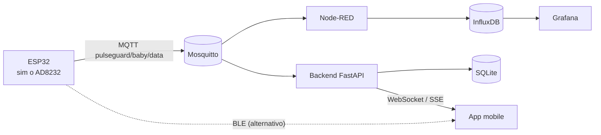

# PulseGuard-Baby 👶❤️

Fascia indossabile **didattica** per il monitoraggio del **battito cardiaco** e
della **temperatura** di un neonato, con rilevamento dell'aderenza della fascia.
Progetto per il corso *Medical Wearable Devices*.

> ⚠️ **Dispositivo didattico, non medico.** Non usare per decisioni sanitarie
> reali. Vedi [`docs/SICUREZZA.md`](docs/SICUREZZA.md).

## Cosa fa

L'ESP32 acquisisce i parametri (sensore ECG **AD8232** reale *oppure* un
simulatore) e li invia **a 1 Hz**. Due percorsi paralleli condividono **lo stesso
payload JSON**, così passare da simulatore a sensore reale non cambia nulla a
valle:



Payload canonico:
```json
{ "device_id": "PULSEGUARD_BABY_04", "timestamp": 1733740000.0,
  "bpm": 121.0, "temperature": 36.6, "sensor_contact": true, "source": "sim" }
```

## Struttura del repository

```
PulseGuard-Baby/
├── firmware/        # MicroPython ESP32: sim + AD8232 reale, MQTT + BLE
├── backend/         # FastAPI: auth JWT, CRUD, ingest MQTT, WebSocket/SSE
├── docker-stack/    # Mosquitto + Node-RED + InfluxDB + Grafana + backend
├── mobile/          # App React Native / Expo (login + monitor realtime)
├── scripts/         # publish_test.py: simula l'ESP32 dal PC
└── docs/            # Fase 2/3: requisiti, use case, E-R, sequence, architettura
```

## Avvio rapido (stack server)

Richiede **Docker** e **Docker Compose**.

```bash
cd docker-stack
cp .env.example .env        # opzionale: già pronto per uso locale
docker compose up -d
```

Servizi disponibili:

| Servizio | URL | Credenziali |
|----------|-----|-------------|
| Grafana (dashboard) | http://localhost:3000 | admin / admin |
| Node-RED (flow) | http://localhost:1880 | — |
| InfluxDB | http://localhost:8086 | admin / pulseguard123 |
| Backend API (docs) | http://localhost:8000/docs | — |
| MQTT | localhost:1883 | anonimo |

La dashboard Grafana **PulseGuard-Baby** e il flow Node-RED sono già
provisionati automaticamente.

### Provare senza hardware

```bash
pip install paho-mqtt
python scripts/publish_test.py --host localhost            # dati nominali
python scripts/publish_test.py --host localhost --scenario tachi   # test allarme
```
Apri Grafana: i grafici si popolano in tempo reale.

## Firmware ESP32 (MicroPython)

1. Copia `firmware/secrets_example.py` in `firmware/secrets.py` e inserisci
   SSID/password del Wi-Fi.
2. In `firmware/config.py` imposta `MQTT_BROKER` con l'**IP del PC** che ospita
   lo stack.
3. Copia su scheda tutti i file di `firmware/` e rinomina **uno** degli
   entrypoint in `main.py`:

   | Scenario | File da usare come `main.py` |
   |----------|------------------------------|
   | Simulatore via MQTT | `main_sim_mqtt.py` |
   | Sensore AD8232 via MQTT | `main_real_mqtt.py` |
   | Simulatore via BLE | `main_sim_ble.py` |
   | Sensore AD8232 via BLE | `main_real_ble.py` |

Cablaggio AD8232: `OUTPUT→GPIO34`, `LO+→GPIO32`, `LO-→GPIO33`, `3.3V`, `GND`
(vedi `firmware/sensor_ecg.py`). L'algoritmo BPM (derivata² + soglia adattiva +
refrattario + mediana RR, stile Pan-Tompkins) è quello tarato in Fase 1.

## App mobile

```bash
cd mobile && npm install && npx expo start
```
Imposta `API_URL` in `mobile/src/config.js` con l'IP del PC. Dettagli in
[`mobile/README.md`](mobile/README.md).

## Documentazione (Fase 2 / Fase 3)

- 📄 **[Relazione tecnica completa (PDF)](docs/RELAZIONE.pdf)** — sorgente LaTeX: [`docs/RELAZIONE.tex`](docs/RELAZIONE.tex)
- [Analisi dei requisiti (RQ-XX)](docs/01-analisi-requisiti.md)
- [Casi d'uso](docs/02-use-case.md)
- [Schema E-R](docs/03-er-schema.md)
- [Diagrammi di sequenza](docs/04-sequence.md)
- [Architettura](docs/05-architettura.md)

## Pubblicare su GitHub

```bash
cd PulseGuard-Baby
git init
git add .
git commit -m "PulseGuard-Baby: firmware, backend, stack Docker, app, docs"
git branch -M main
git remote add origin https://github.com/TUO_UTENTE/PulseGuard-Baby.git
git push -u origin main
```
> `secrets.py` e `.env` sono già in `.gitignore`: le tue password non finiranno
> nel repository.

## Licenza

MIT — vedi [`LICENSE`](LICENSE). Progetto didattico.
