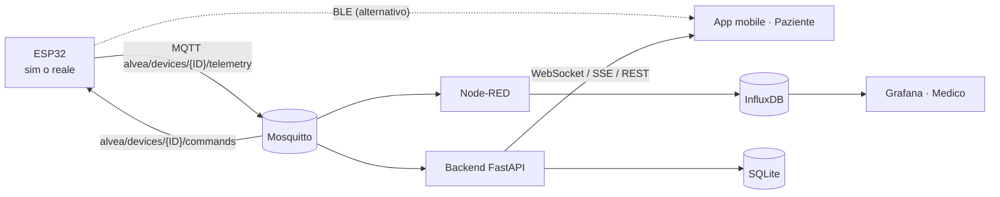
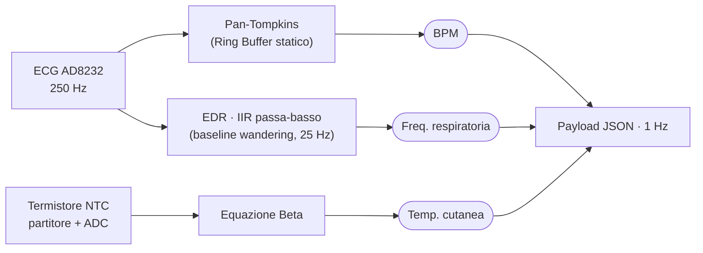
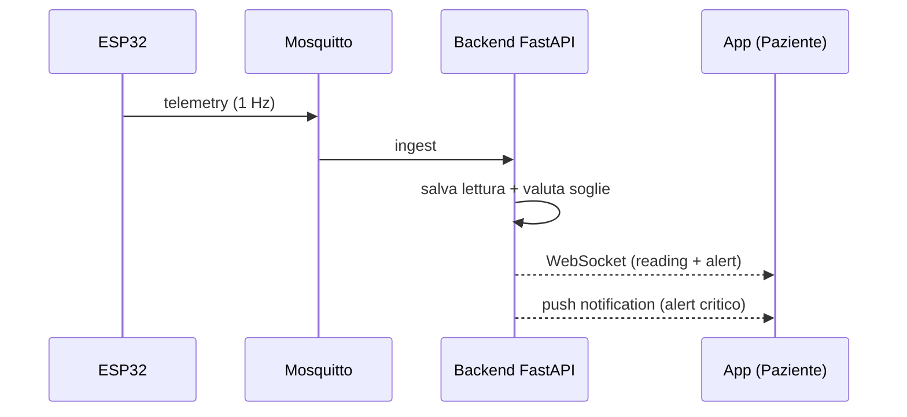

<div align="center">

# �AE Alvea

### Wearable da caviglia per il monitoraggio dell'asma pediatrico

Acquisizione continua di **frequenza respiratoria** (EDR da ECG), **battito cardiaco** e
**temperatura cutanea** (termistore NTC), con rilevamento dell'aderenza degli elettrodi,
alert clinici in tempo reale, app mobile per il paziente e dashboard per il medico.


</div>

> [!WARNING]
> **Dispositivo didattico, non medico.** Realizzato per *Academy Medical Wearable
> Devices*. Non utilizzare per decisioni sanitarie reali. Vedi [`docs/SICUREZZA.md`](docs/SICUREZZA.md).

---

## ✨ In breve

L'ESP32 acquisisce i parametri da un **ECG (AD8232)** — dal quale ricava battito **e**
respiro tramite **EDR** (ECG-Derived Respiration) — e da un **termistore NTC** di
precisione (*oppure* da un simulatore HIL), e li invia **a 1 Hz**. Il canale è
**bidirezionale**: il dispositivo riceve dal backend la configurazione del medico
(es. frequenza di campionamento). Due percorsi paralleli condividono **lo stesso
payload JSON**, così passare dal simulatore al sensore reale non cambia nulla a valle.

| | |
|---|---|
| 🔴 **Alert clinici** | Tachipnea (respiro), tachicardia/bradicardia (BPM), febbre (temp. cutanea) |
| 👤 **Ruoli** | Paziente/Caregiver (vede solo i propri dati) · Medico (vede tutti, configura le soglie) |
| 📈 **Serie temporali** | InfluxDB + Grafana: ultimo valore, andamento, medie/min/max |
| 📱 **App mobile** | Real-time via WebSocket, storico, **notifiche** push/locali |
| 🔐 **Sicurezza** | JWT + bcrypt, isolamento dei dati per ruolo, **audit log** delle operazioni |

## 🗺️ Architettura



### 🔬 Pipeline di acquisizione (sensori → metriche)



### 🔁 Flusso telemetria e alert



## 📦 Payload canonico

```json
{
  "device_id": "ALVEA_ASTHMA_ANKLE_01",
  "timestamp": 1733740000.0,
  "bpm": 95.0,
  "respiration_rate": 22.0,
  "skin_temperature": 32.5,
  "sensor_contact": true,
  "device_status": "SYSTEM_OK",
  "source": "production_firmware"
}
```

## 🩺 Scenari clinici (simulatore)

| Scenario | Effetto | Alert atteso |
|---|---|---|
| `nominal` | Bambino a riposo | nessuno |
| `asthma_attack` | respiro ↑ (40–50), battito ↑ (115–130) | **critico** tachipnea + tachicardia |
| `fever` | Temp. cutanea ↑ (35.5–37.0) | **warning** febbre |
| `hardware_fault` | Sensore staccato | **tecnico** (nessun falso positivo) |

## ✅ Conformità ai requisiti

| # | Requisito | Stato | Dove |
|---|---|:--:|---|
| 1 | Acquisizione dati wearable (MQTT) | ✅ | `firmware/`, `scripts/publish_test.py` |
| 2 | Backend real-time + soglie | ✅ | `backend/` (REST, WebSocket, SSE) |
| 3 | App mobile (real-time, storico, notifiche) | ✅ | `mobile/` |
| 4 | Ruoli e permessi (Paziente / Medico) | ✅ | `backend/app/auth.py`, `main.py` |
| 5 | Database serie temporali | ✅ | InfluxDB + Grafana |
| 6 | Dashboard medico Grafana | ✅ | `docker-stack/grafana/` |
| 7 | Gestione alert (paziente, parametro, gravità…) | ✅ | `backend/app/alerts.py` |
| 8 | Configurazione del medico (soglie) | ✅ | `PUT /devices/{id}/thresholds` |
| 9 | Scheda paziente / anamnesi | ✅ | `GET/PUT /devices/{id}/patient` |
| 10 | Sicurezza, privacy e audit | ✅ | JWT, RBAC, `AuditLog` |
| 11 | Documentazione architettura e API | ✅ | `docs/` |

## 🚀 Avvio rapido (stack server)

Richiede **Docker** e **Docker Compose**.

```bash
cd docker-stack
cp .env.example .env        # opzionale: già pronto per uso locale
docker compose up -d
```

| Servizio | URL | Credenziali |
|---|---|---|
| 📊 Grafana (dashboard medico) | http://localhost:3000 | `admin` / `admin` |
| 🔧 Node-RED (motore regole) | http://localhost:1880 | — |
| 🗄️ InfluxDB (serie temporali) | http://localhost:8086 | `admin` / `alvea123` |
| ⚡ Backend API (Swagger) | http://localhost:8000/docs | — |
| 📡 MQTT Broker | `localhost:1883` | anonimo |

> Dashboard Grafana e flow Node-RED sono **provisionati automaticamente**.

## 🧪 Prova senza hardware

```bash
pip install paho-mqtt
python scripts/publish_test.py --host localhost                      # dati nominali
python scripts/publish_test.py --host localhost --scenario asthma_attack   # allarme asma
```

I grafici storici e gli alert si popolano in tempo reale su Grafana e sull'app.

## 🔌 Firmware ESP32 (MicroPython)

1. Copia `firmware/secrets_example.py` in `firmware/secrets.py` e inserisci SSID/password Wi-Fi.
2. In `firmware/config.py` imposta `MQTT_BROKER` con l'IP del PC che ospita lo stack.
3. Copia su scheda i file di `firmware/` e rinomina l'entrypoint scelto in `main.py`:

| Scenario | Entrypoint |
|---|---|
| Simulatore Test-Rig via MQTT | `main_sim_mqtt.py` |
| Hardware reale via MQTT (prod) | `main_real_mqtt.py` |
| Simulatore Test-Rig via BLE | `main_sim_ble.py` |
| Hardware reale via BLE | `main_real_ble.py` |

**Cablaggio sensori reali:** ECG (AD8232) `OUTPUT→GPIO34, LO+→GPIO32, LO-→GPIO33` ·
termistore NTC `partitore→GPIO35 (ADC)`.

> Il **BPM** è calcolato con **Pan-Tompkins** sull'ECG; la **frequenza respiratoria**
> è ricavata dallo *stesso* ECG via **EDR** (filtro IIR passa-basso sul baseline
> wandering). La **temperatura** usa l'**equazione Beta** del termistore NTC.

## 📱 App mobile (React Native / Expo)

```bash
cd mobile && npm install && npm run start
```

Imposta `API_URL` in `mobile/src/config.js` con l'IP del PC. Notifiche e build di
sviluppo: vedi [`mobile/README.md`](mobile/README.md).

## 📁 Struttura del repository

```text
Alvea/
├── firmware/        # MicroPython ESP32: Pan-Tompkins ECG, EDR respiro, NTC, MQTT async
├── backend/         # FastAPI: RBAC (Medico/Paziente), REST, WebSocket/SSE, alert, audit
├── docker-stack/    # Mosquitto + Node-RED + InfluxDB + Grafana + backend + mobile (dev)
├── mobile/          # App React Native / Expo (real-time, notifiche, storico)
├── scripts/         # publish_test.py: simulatore HIL della periferica
└── docs/            # Requisiti, use case, E-R, sequence, architettura, sicurezza
```

## 📚 Documentazione

- 📄 **[Relazione tecnica (PDF)](docs/RELAZIONE.pdf)** — sorgente: [`docs/RELAZIONE.tex`](docs/RELAZIONE.tex)
- [Analisi dei requisiti](docs/01-analisi-requisiti.md) · [Casi d'uso](docs/02-use-case.md) · [Schema E-R](docs/03-er-schema.md)
- [Diagrammi di sequenza](docs/04-sequence.md) · [Architettura e API](docs/05-architettura.md) · [Sicurezza](docs/SICUREZZA.md)

## 📄 Licenza

Distribuito con licenza **MIT** (vedi [`LICENSE`](LICENSE)). Progetto didattico accademico.
