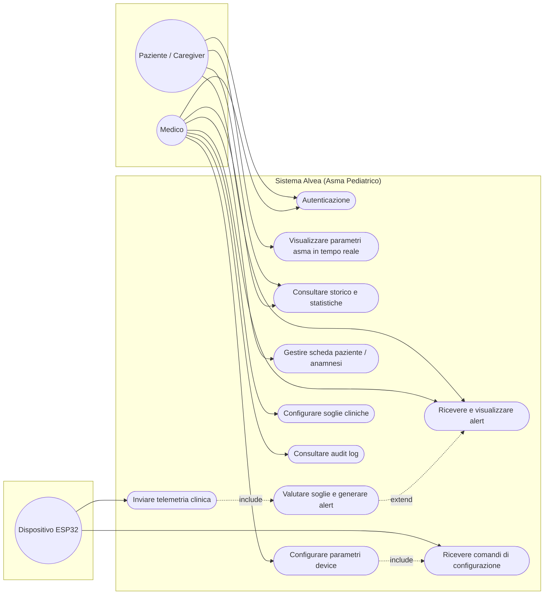

# Fase 3 — Diagramma dei Casi d'Uso

Attori: **Paziente / Caregiver** (attore primario, lato genitore: monitora e
consulta i propri dati), **Medico** (attore primario con permessi estesi: vede
tutti i pazienti, configura le soglie cliniche e consulta l'audit log) e
**Dispositivo ESP32** (attore secondario che immette telemetria e riceve
configurazioni). La distinzione dei due ruoli applicativi è **implementata** nel
backend (RBAC sul campo `role`); vedi la nota in fondo.

## Specifica del caso d'uso principale — *Visualizzare in tempo reale* (UC2)

- **Attore primario:** Caregiver
- **Precondizioni:** L'utente è autenticato (RQ-12); il dispositivo ESP32 è associato al paziente (RQ-14).
- **Flusso base:**
1. Il paziente apre la schermata Monitor dell'app mobile.
2. L'app apre il canale WebSocket verso il backend API (con fallback SSE/polling REST).
3. L'ESP32 pubblica una lettura MQTT completa (BPM, frequenza respiratoria via EDR, temperatura cutanea, batteria).
4. Il backend la riceve, la valida, la storicizza su DB relazionale (e opzionalmente su InfluxDB) e la inoltra istantaneamente via WebSocket.
5. L'app aggiorna l'interfaccia grafica con i nuovi valori fisiologici.
- **Flusso alternativo A (fascia staccata):** se `sensor_contact == false`, il
  sistema mostra l'avviso tecnico e sospende la valutazione fisiologica (RQ-08).
- **Postcondizioni:** la lettura è persistita e visibile anche su Grafana (RQ-11), tramite il percorso parallelo Node-RED → InfluxDB.

> Mermaid non ha la notazione UML "a palloncino" nativa: questa è
> un'approssimazione fedele.

## Nota sui ruoli

La distinzione dei ruoli è **implementata** nel backend: l'entità `Caregiver`
(`backend/app/models.py`) ha un campo `role` (`caregiver` | `medico`) incluso
nel token JWT. Gli endpoint riservati al medico — configurazione delle soglie
(`PUT /devices/{id}/thresholds`) e consultazione dell'audit log (`GET /audit`) —
sono protetti dalla dipendenza `require_medico`, mentre l'isolamento dei dati
per proprietario è centralizzato in `authorized_device()` e vale anche sul
canale realtime (WebSocket/SSE). Nell'app mobile la distinzione è agganciata al
`role` restituito dal login: le funzionalità del medico (dashboard Grafana,
configurazione del device) sono mostrate solo all'utente con ruolo `medico`.
Dettagli in `docs/SICUREZZA.md`.
