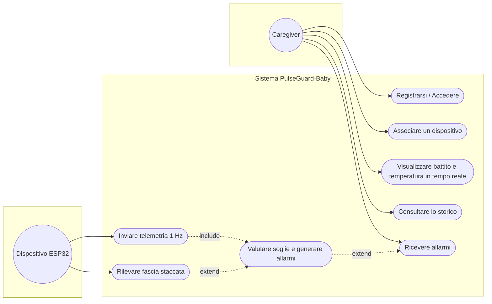

# Fase 3 — Diagramma dei Casi d'Uso

Attori: **Caregiver** (genitore/operatore), **Dispositivo ESP32** (attore
secondario che immette telemetria), **Sistema di Allarme** (tempo).

## Specifica del caso d'uso principale — *Visualizzare in tempo reale* (UC3)

- **Attore primario:** Caregiver
- **Precondizioni:** caregiver autenticato (RQ-12); dispositivo associato (RQ-14).
- **Flusso base:**
  1. Il caregiver apre la schermata Monitor dell'app.
  2. L'app apre il canale WebSocket verso il backend (`/ws/live`).
  3. L'ESP32 pubblica una lettura su MQTT (RQ-04).
  4. Il backend la valida, la salva e la inoltra via WebSocket (RQ-10, RQ-13).
  5. L'app aggiorna BPM, temperatura e stato fascia.
- **Flusso alternativo A (fascia staccata):** se `sensor_contact == false`, il
  sistema mostra l'avviso tecnico e sospende la valutazione fisiologica (RQ-08).
- **Postcondizioni:** la lettura è persistita e visibile anche su Grafana (RQ-11).

> Mermaid non ha la notazione UML "a palloncino" nativa: questa è
> un'approssimazione fedele. Per la consegna formale puoi rigenerarla identica
> in PlantUML/draw.io mantenendo attori, include ed extend qui descritti.
