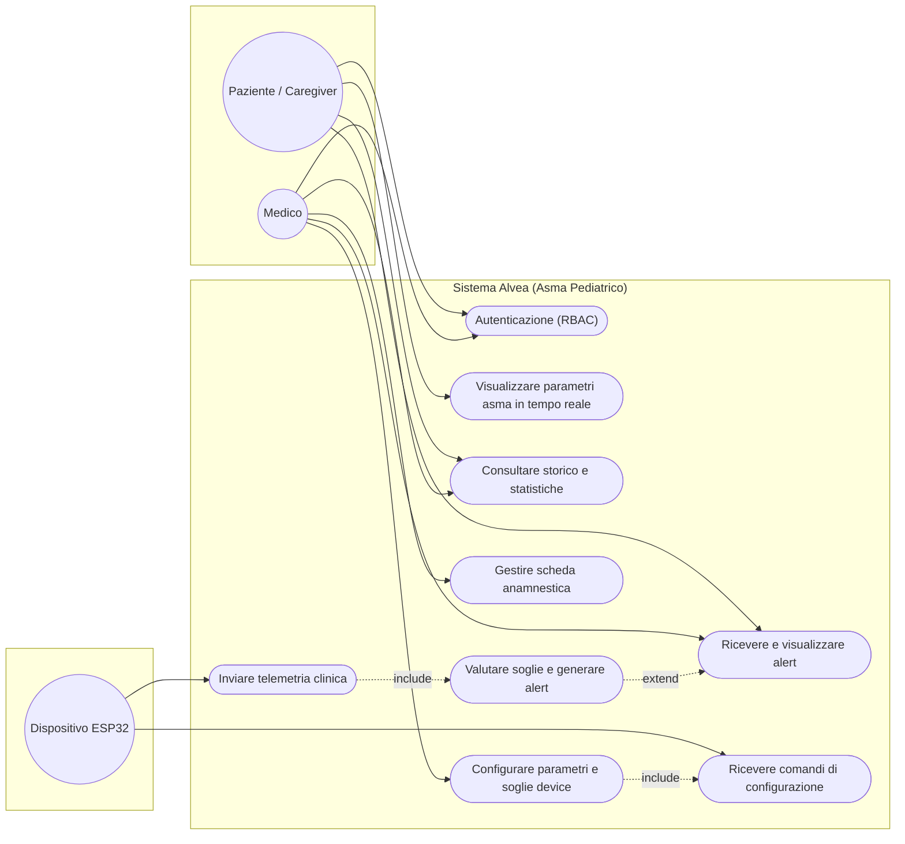

# Fase 3 — Diagramma dei Casi d'Uso

[cite_start]Attori: **Paziente / Caregiver** (attore primario), **Medico** (attore primario con permessi estesi) [cite: 39, 41][cite_start], e **Dispositivo ESP32** (attore secondario che immette telemetria e riceve configurazioni)[cite: 106].

## Specifica del caso d'uso principale — *Visualizzare in tempo reale* (UC3)

- **Attore primario:** Caregiver
- **Precondizioni:** L'utente è autenticato con il ruolo corretto (RQ-12) ; il dispositivo ESP32 è associato al paziente (RQ-14).
- **Flusso base:**
1. Il paziente apre la schermata Monitor dell'app mobile.
2. L'app apre il canale WebSocket/SSE verso il backend API.
3. L'ESP32 pubblica una lettura MQTT completa (SpO2, frequenza respiratoria, BPM, Temp).
4. Il backend la riceve, la storicizza su InfluxDB e la inoltra istantaneamente via WebSocket.
5. L'app aggiorna l'interfaccia grafica con i nuovi valori fisiologici.
- **Flusso alternativo A (fascia staccata):** se `sensor_contact == false`, il
  sistema mostra l'avviso tecnico e sospende la valutazione fisiologica (RQ-08).
- **Postcondizioni:** la lettura è persistita e visibile anche su Grafana (RQ-11).

> Mermaid non ha la notazione UML "a palloncino" nativa: questa è
> un'approssimazione fedele.
