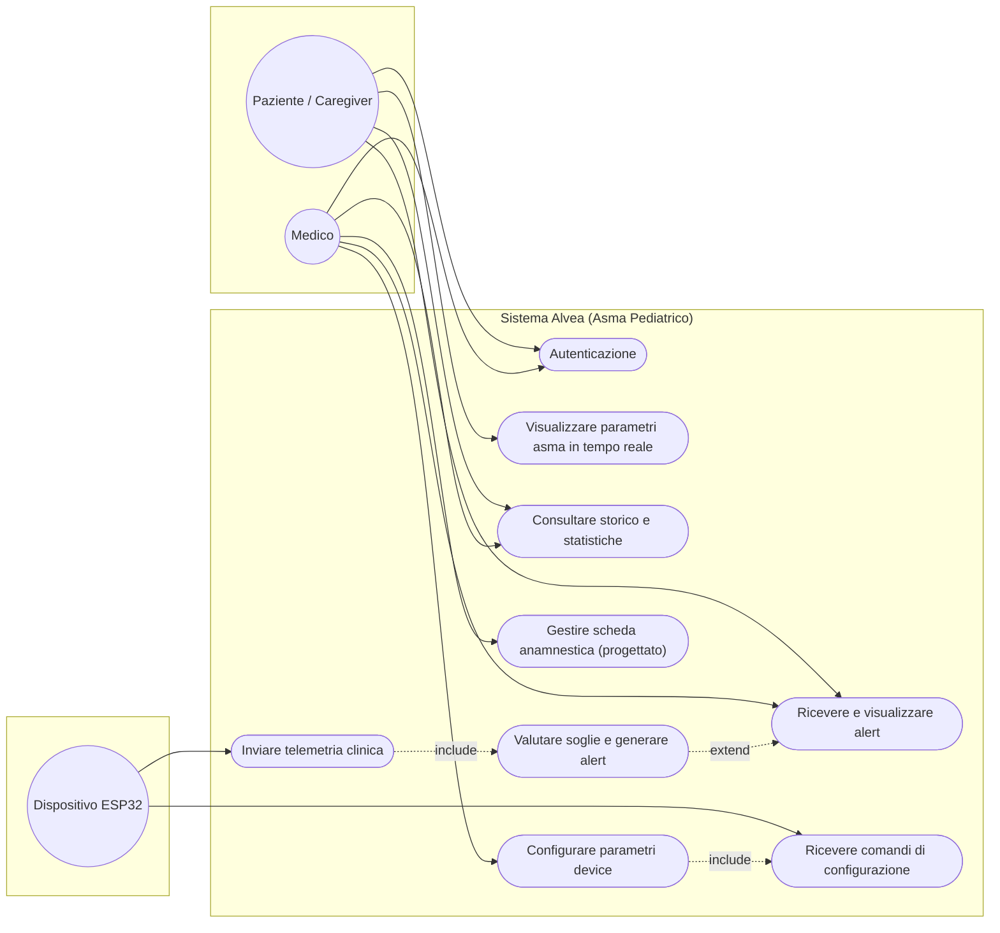

# Fase 3 — Diagramma dei Casi d'Uso

Attori: **Paziente / Caregiver** (attore primario, unico ruolo applicativo
oggi implementato), **Medico** (attore primario con permessi estesi —
ruolo *progettato*, non ancora distinto a livello di autenticazione, vedi
nota in fondo), e **Dispositivo ESP32** (attore secondario che immette
telemetria e riceve configurazioni).

## Specifica del caso d'uso principale — *Visualizzare in tempo reale* (UC2)

- **Attore primario:** Caregiver
- **Precondizioni:** L'utente è autenticato (RQ-12); il dispositivo ESP32 è associato al paziente (RQ-14).
- **Flusso base:**
1. Il paziente apre la schermata Monitor dell'app mobile.
2. L'app apre il canale WebSocket verso il backend API (con fallback SSE/polling REST).
3. L'ESP32 pubblica una lettura MQTT completa (BPM, frequenza respiratoria via EDR, temperatura cutanea, batteria).
4. Il backend la riceve, la valida, la storicizza su DB relazionale (e opzionalmente su InfluxDB) e la inoltra istantaneamente via WebSocket.
5. L'app aggiorna l'interfaccia grafica con i nuovi valori fisiologici.
- **Flusso alternativo A (fascia staccata):** se `sensor_contact == false`, il
  sistema mostra l'avviso tecnico e sospende la valutazione fisiologica (RQ-08).
- **Postcondizioni:** la lettura è persistita e visibile anche su Grafana (RQ-11), tramite il percorso parallelo Node-RED → InfluxDB.

> Mermaid non ha la notazione UML "a palloncino" nativa: questa è
> un'approssimazione fedele.

## Nota sui ruoli

Il backend attuale (`backend/app/models.py`) ha una sola entità utente,
`Caregiver`, senza distinzione di ruolo: l'attore "Medico" qui sopra
rappresenta l'uso *progettato* del sistema (vedi `docs/RELAZIONE.tex`,
Sezione "Ruoli, Autenticazione e Multitenancy"). Nell'app mobile, le
funzionalità pensate per il Medico (dashboard Grafana, configurazione
remota del device) sono oggi visibili a qualunque Caregiver autenticato.
