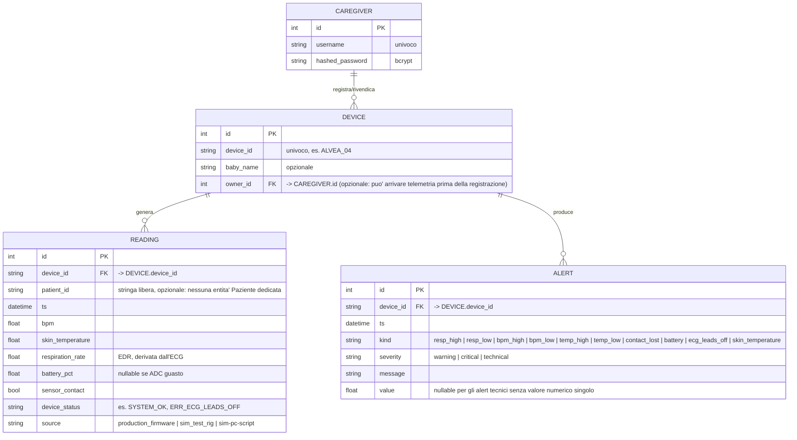

# Fase 3 — Schema Entità-Relazione

Modello dati persistente del backend, allineato a `backend/app/models.py`.

## Note di progettazione
- **Cardinalità:** un Caregiver ha 0..N Device; un Device ha 0..N Reading e
  0..N Alert. Un Device può esistere *senza* owner (la telemetria può arrivare
  prima dell'associazione manuale: vedi `crud.ensure_device`).
- **Nessun campo SpO2:** il dispositivo ha un solo sensore biomedicale,
  l'ECG (AD8232). BPM e frequenza respiratoria (via EDR) derivano da quello;
  la temperatura cutanea da un termistore NTC analogico separato.
- **Nessuna entità Paziente/Anamnesi dedicata (PLAN):** `patient_id` è oggi
  una semplice stringa opzionale su `Reading`, non una chiave esterna verso
  una tabella `PATIENT`. Una scheda anamnestica strutturata (patologie,
  farmaci, allergie) è un'evoluzione progettata ma non implementata — vedi
  `docs/RELAZIONE.tex`, Sezione "Stato di Implementazione".
- **Nessun campo `role`:** `CAREGIVER` non distingue Medico da Paziente: è
  un unico tipo di account con isolamento dei dati per `owner_id`.
- **Serie temporali:** le `READING` ad alta frequenza vivono anche su InfluxDB
  (misura `vitals`, bucket `vitals`) per la dashboard Grafana, scritte dal
  flow Node-RED; il DB relazionale conserva lo storico per l'app e gli allarmi.
