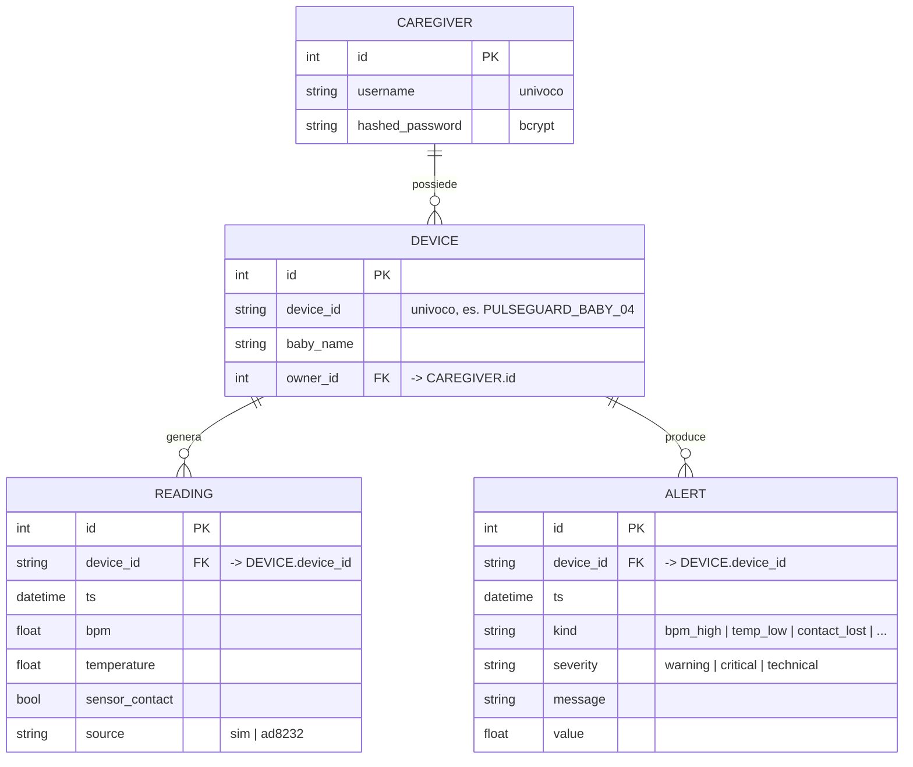

# Fase 3 — Schema Entità-Relazione

Modello dati persistente del backend (vedi `backend/app/models.py`).

## Note di progettazione
- **Cardinalità:** un Caregiver ha 0..N Device; un Device ha 0..N Reading e
  0..N Alert. Un Device può esistere *senza* owner (la telemetria può arrivare
  prima dell'associazione manuale: vedi `crud.ensure_device`).
- **Serie temporali:** le `READING` ad alta frequenza vivono anche su InfluxDB
  (misura `vitals`) per la dashboard Grafana; il DB relazionale conserva lo
  storico per l'app e gli allarmi.
