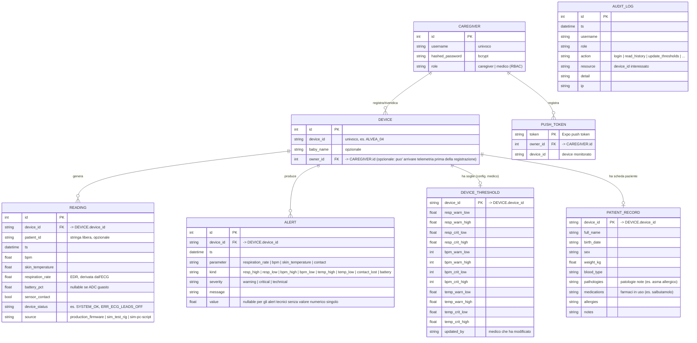

# Fase 3 — Schema Entità-Relazione

Modello dati persistente del backend, allineato a `backend/app/models.py`.

## Note di progettazione
- **Cardinalità:** un Caregiver ha 0..N Device; un Device ha 0..N Reading,
  0..N Alert, 0..1 DeviceThreshold e 0..1 PatientRecord. Un Device può esistere
  *senza* owner (la telemetria può arrivare prima dell'associazione manuale:
  vedi `crud.ensure_device`).
- **Sensoristica:** il dispositivo ha un solo sensore biomedicale,
  l'ECG (AD8232). BPM e frequenza respiratoria (via EDR) derivano da quello;
  la temperatura cutanea da un termistore NTC analogico separato.
- **Ruoli (RBAC):** il campo `CAREGIVER.role` distingue `caregiver` (lato
  Paziente, vede solo i propri device) e `medico` (vede tutti, configura le
  soglie, consulta l'audit log). Il controllo di proprietà è centralizzato in
  `authorized_device()` (vedi `backend/app/main.py`).
- **Soglie configurabili:** `DEVICE_THRESHOLD` conserva le soglie cliniche
  per-device impostate dal medico; in sua assenza si usano i default di
  `config.DEFAULT_THRESHOLDS`.
- **Scheda paziente:** `PATIENT_RECORD` contiene anagrafica e anamnesi
  (patologie, farmaci, allergie) del bambino associato al device.
- **Audit log:** `AUDIT_LOG` è un registro append-only delle operazioni
  rilevanti (sicurezza/privacy), consultabile dal solo medico.
- **Serie temporali:** le `READING` ad alta frequenza vivono anche su InfluxDB
  (misura `vitals`, bucket `vitals`) per la dashboard Grafana, scritte dal
  flow Node-RED; il DB relazionale conserva lo storico per l'app e gli allarmi.
