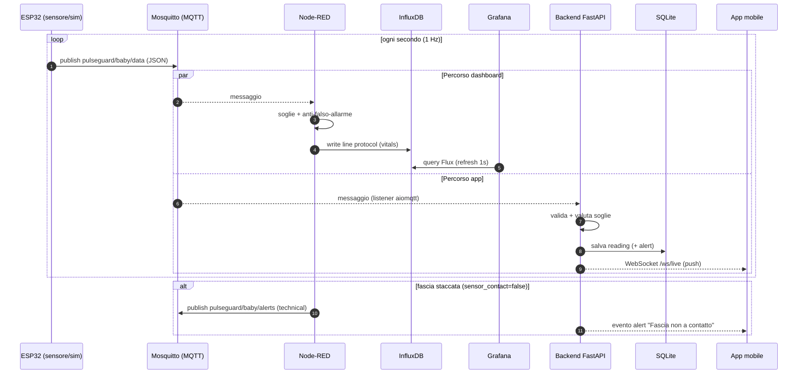
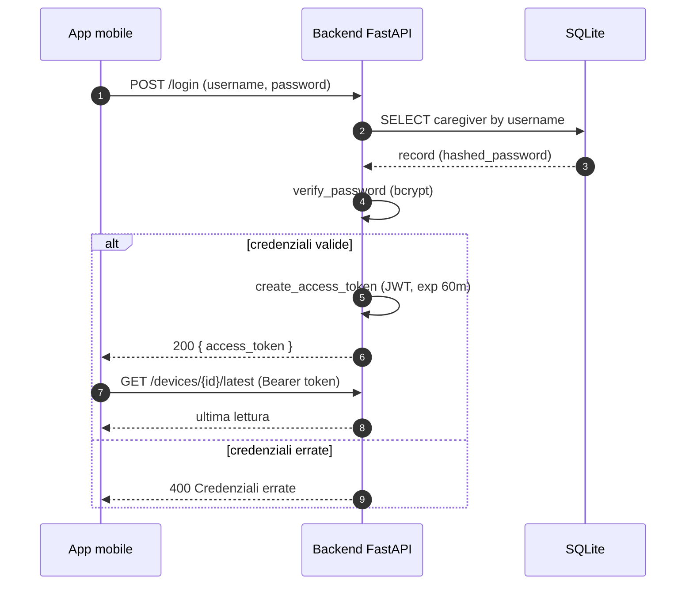

# Fase 3 — Diagrammi di Sequenza

## 1) Ingest telemetria e propagazione realtime

```mermaid
sequenceDiagram
    autonumber
    participant ESP as ESP32 (sensore/sim)
    participant MQ as Mosquitto (MQTT)
    participant NR as Node-RED
    participant DB as InfluxDB
    participant GF as Grafana
    participant BE as Backend FastAPI
    participant SQ as SQLite
    participant APP as App mobile

    loop ogni secondo (1 Hz)
        ESP->>MQ: publish pulseguard/baby/data (JSON)
        par Percorso dashboard
            MQ-->>NR: messaggio
            NR->>NR: soglie + anti-falso-allarme
            NR->>DB: write line protocol (vitals)
            GF->>DB: query Flux (refresh 1s)
        and Percorso app
            MQ-->>BE: messaggio (listener aiomqtt)
            BE->>BE: valida + valuta soglie
            BE->>SQ: salva reading (+ alert)
            BE-->>APP: WebSocket /ws/live (push)
        end
    end

    alt fascia staccata (sensor_contact=false)
        NR->>MQ: publish pulseguard/baby/alerts (technical)
        BE-->>APP: evento alert "Fascia non a contatto"
    end
```

## 2) Autenticazione del caregiver (JWT)

```mermaid
sequenceDiagram
    autonumber
    participant APP as App mobile
    participant BE as Backend FastAPI
    participant SQ as SQLite

    APP->>BE: POST /login (username, password)
    BE->>SQ: SELECT caregiver by username
    SQ-->>BE: record (hashed_password)
    BE->>BE: verify_password (bcrypt)
    alt credenziali valide
        BE->>BE: create_access_token (JWT, exp 60m)
        BE-->>APP: 200 { access_token }
        APP->>BE: GET /devices/{id}/latest (Bearer token)
        BE-->>APP: ultima lettura
    else credenziali errate
        BE-->>APP: 400 Credenziali errate
    end
```
