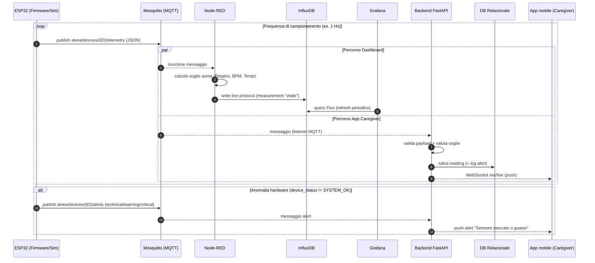
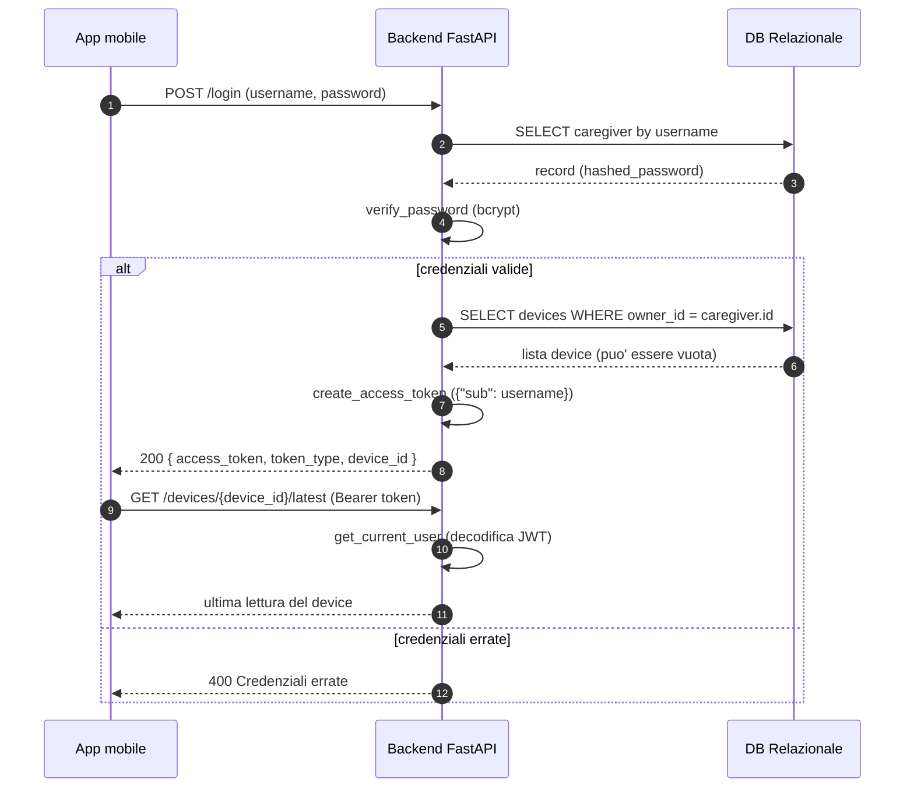
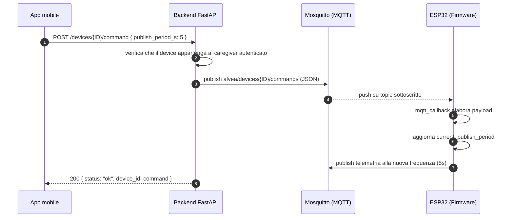

# Fase 3 — Diagrammi di Sequenza

## 1) Ingest telemetria e propagazione realtime

## 2) Autenticazione del caregiver (JWT)

> Nota: `device_id` nella risposta di login è il primo device associato
> al caregiver (None se non ne ha ancora registrato nessuno). Non esiste
> un campo `role`: l'autenticazione odierna ha un solo tipo di account
> (Caregiver), con isolamento dei dati per `owner_id` — vedi
> `docs/03-er-schema.md`.

## 3) Configurazione da remoto del Dispositivo

