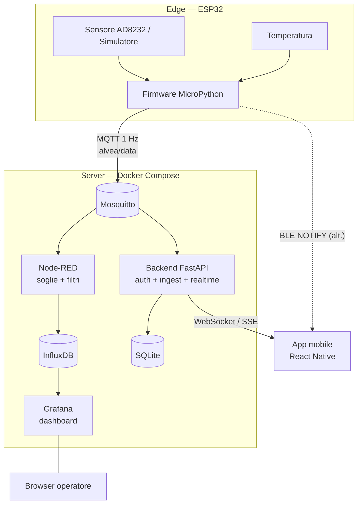

# Architettura del Sistema

## Vista d'insieme (data flow)

Due percorsi paralleli, **stesso payload**:
- **Operativo:** ESP32 → MQTT → Node-RED → InfluxDB → Grafana (grafici storici).
- **Applicativo:** ESP32 → MQTT → Backend → SQLite → WebSocket → App (live + auth).
- **Alternativo:** ESP32 → BLE → App (collegamento diretto senza rete).

## Modello 4+1 (sintesi)

- **Vista logica:** Caregiver, Device, Reading, Alert (vedi E-R).
- **Vista di processo:** task asincroni del backend (listener MQTT + endpoint
  REST/WebSocket/SSE) che girano in concorrenza tramite `asyncio`.
- **Vista di sviluppo:** monorepo a moduli — `firmware/`, `backend/`,
  `docker-stack/`, `mobile/`, `scripts/`, `docs/`.
- **Vista fisica:** ESP32 (edge) ↔ rete Wi-Fi locale ↔ host Docker (PC) ↔
  smartphone. Nessun servizio in cloud: tutto in LAN (vincolo privacy).
- **Scenari (+1):** i casi d'uso del documento Fase 3.

## Porte dei servizi

| Servizio | Porta | URL locale |
|----------|-------|------------|
| MQTT (Mosquitto) | 1883 / 9001 | `mqtt://localhost:1883` |
| Node-RED | 1880 | http://localhost:1880 |
| InfluxDB | 8086 | http://localhost:8086 |
| Grafana | 3000 | http://localhost:3000 |
| Backend API | 8000 | http://localhost:8000 |
