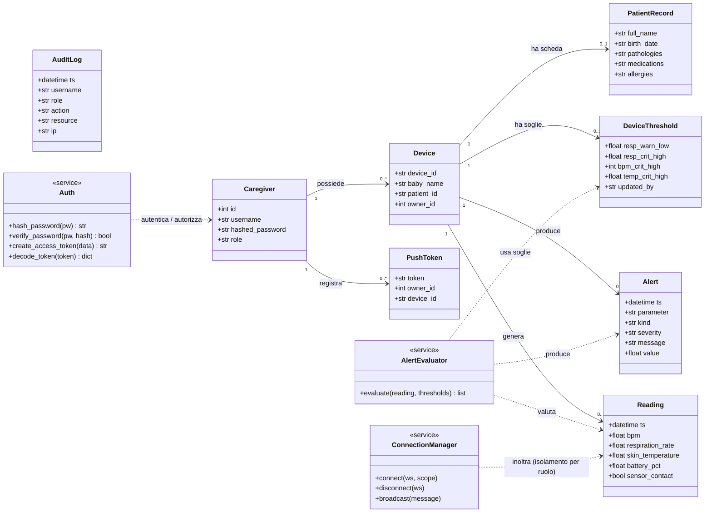
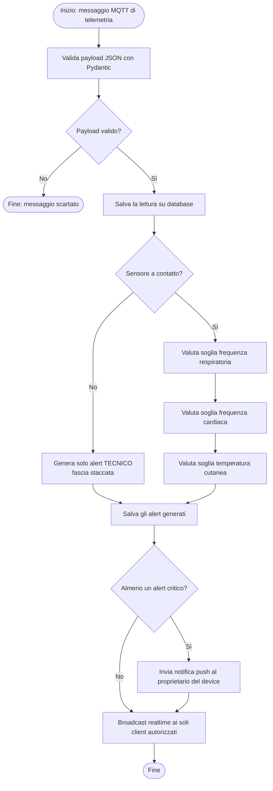

# Fase 3 — Diagramma delle Classi e Diagramma di Attività

Questi due diagrammi completano la vista di progettazione (modello 4+1) del
backend Alvea, insieme al Diagramma dei Casi d'Uso (`02-use-case.md`), allo
Schema E-R (`03-er-schema.md`) e ai Diagrammi di Sequenza (`04-sequence.md`).

- Il **Diagramma delle Classi** descrive la *struttura del codice* (vista
  logica): le entità del dominio e i servizi che le elaborano.
- Il **Diagramma di Attività** descrive il *flusso* della valutazione delle
  soglie cliniche e della generazione degli alert (logica di business).

---

## 1) Diagramma delle Classi (vista logica del backend)

Le classi in alto sono le entità del dominio persistite tramite l'ORM
SQLAlchemy (`backend/app/models.py`); quelle marcate `<<service>>` sono i moduli
applicativi che le elaborano (autenticazione, valutazione degli alert, realtime).
Lo schema evidenzia la parte relativa a **sicurezza, autorizzazioni e logica
degli alert**: `Auth` (JWT + bcrypt + ruoli), `AlertEvaluator` (soglie cliniche)
e il `ConnectionManager` che applica l'isolamento dei dati sul canale realtime.

> Nota: `AuditLog` è un registro append-only alimentato dalle operazioni
> rilevanti (login, letture, modifica soglie, scheda paziente); non ha relazioni
> di chiave esterna con le altre entità perché traccia eventi, non stato.

---

## 2) Diagramma di Attività — valutazione soglie e generazione alert

Modella il percorso di una singola lettura di telemetria dalla ricezione MQTT
fino al broadcast in tempo reale, con la **regola anti-panico**: se il sensore
non è a contatto si emette solo un alert *tecnico* e si sospende la valutazione
fisiologica, evitando falsi allarmi (`backend/app/alerts.py`,
`backend/app/mqtt_ingest.py`).

> Le soglie applicate sono quelle configurate dal medico per il device
> (`DeviceThreshold`) oppure, in loro assenza, i default di
> `config.DEFAULT_THRESHOLDS`. Ogni alert riporta paziente, parametro,
> descrizione, gravità e timestamp (Gestione alert - Core).
